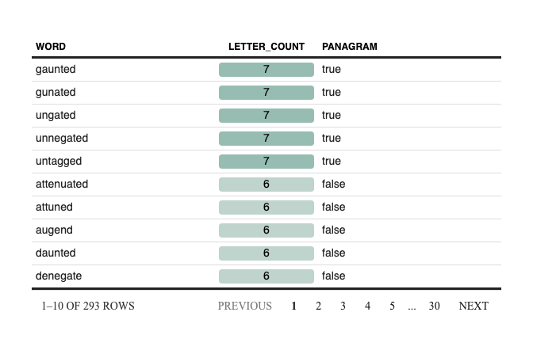

<!-- README.md is generated from README.Rmd. Please edit that file -->

# NewYoRkTimes

<!-- badges: start -->

[](https://github.com/dungates/NewYoRkTimes/actions)
<!-- badges: end -->

The goal of NYT is to …

## Installation

You can install the released version of NYT from
[CRAN](https://CRAN.R-project.org) with:

``` r
install.packages("NYT")
```

And the development version from [GitHub](https://github.com/) with:

``` r
# install.packages("devtools")
devtools::install_github("dungates/NewYoRkTimes")
```

## Example

You can solve the Spelling Bee puzzle of the day like so:

``` r
library(NYT)
## basic example code
nyt_solve(bee_letters = "dungate", middle_letter = "d")
#> Joining, by = "value"
```

<!-- -->

You can solve the mini crossword like so:

To be added
